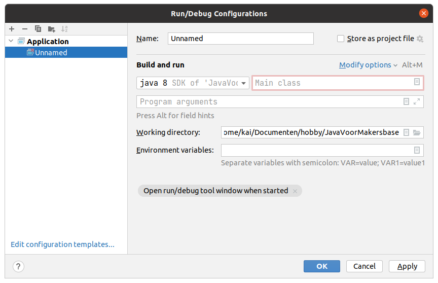

#1. Console applicaties
## 1a Het eerste programma
Klik links met je rechtermuisknop op de map en kies in het contextmenu op 'New' en dan op 'Java class...', er verschijnt een popup waarin gevraagd wordt om de naam van de klasse, vul hiervoor 'main' in. Er verschijnt een bestand waarin al tekst staat en waar we tekst aan gaan toevoegen. Voeg direct onder de regel die begint met ´public' de volgende tekst toe (inclusief de witruimte aan het begin van de regels):
```
    public static void main(String[] args) {
        System.out.println("Hallo! Welkom bij Makersbase!");
    }
``` 

## 1b Configuraties
Om dit programma te starten kun je rechtsboven klikken op een grijs driehoekje dat naar rechts wijst. 

We moeten echter wel wat instellingen doen voordat dat werkt (en het driehoekje groen wordt). Links van dat grijze driehoekje staat een knop 'Add Configuration...', klik hierop en klik vervolgens in het scherm dat verschijnt links op het plusicoontje, in het menu klik je op 'Application'. Rechts verschijnt een formulier.


- Vul bovenaan achter 'name' een naam in voor de configuraties die je deze keer maakt. Meestal maak je maar 1 setje configuraties en is bijvoorbeeld 'main' als naam ruim voldoende. Echter schrijven we in deze tutorial meerdere programma's schrijven en dan is het wel handig om aan te kunnen geven welke je wilt starten, in dit geval is 'les01' als naam het handigst.
- Direct onder build and run staat een dropdownmenu en een tekstvakje met rechts een klein rechthoekig symbooltje. In het dropdownmenu moet java 8 geselecteerd zijn en in het tekstvak ernaast kunnen we uit ons hoofd iets invullen. Maar makkelijker is om op het rechthoekige icoontje rechts te klikken en ons enige suggesties te laten voor schotelen. In het venster wat dan verschijnt staat als het goed is maar 1 suggestie, genaamd 'main les01', klik deze aan. Als je dat allemaal gedaan hebt, klik rechtsonder op apply en daarna op OK. Als het goed is is het grijze driehoekje, rechtsboven aan, nu groen geworden.

Klik op dit groene driehoekje en wacht even af wat er gebeurt.

Het programma wordt gestart en onderin het beeld verschijnt het resultaat in tekstvorm, iets wat we onder softwareontwikkelaars een console noemen, en direct daarna wordt het programma ook weer afgesloten.


Je eerste programma is een feit!

## 1c Wat hebben we nu eigenlijk gedaan?
Kort samengevat hebben we bij 1a een heel klein programma geschreven en bij 1b hebben we instellingen gedaan waarmee de compiler weet waar hij het programma moet beginnen.

Computers kunnen diep van binnen eigenlijk alleen 0'en en 1'en aan. Een programma zoals wij zojuist bij 1a hebben geschreven is niet iets wat computers begrijpen, laat staan kunnen uitvoeren. Om te zorgen dat het begrepen wordt door computers moeten we het eerst compileren. Dat is best handig want als we iets gemaakt hebben wat de computer niet gaat begrijpen geeft de compiler dit direct aan.

Programma's zijn eigenlijk niet meer dan instructies voor de computer, maar ze worden niet van boven naar beneden gelezen en uitgevoerd. Als je zou willen kun je in het midden beginnen (wordt het wel wat onoverzichtelijk van), laten pauzeren, delen overslaan, herhalen, tussendoor van alles opslaan en aanpassen, keuzes maken en zelfs instructies uit andere bestanden laten uitvoeren. Hierover later meer.

Het programma wat we hebben geschreven bij 1a bestaat uit 1 methode, een methode is een onderdeel van een programma dat vanaf het begin van die methode wordt uitgevoerd tot het einde. Onze methode heeft een ´head' en een 'body'. De head bestaat over het algemeen uit 1 regel, bij ons programma is dat regel 4. Ons programma is nog niet zo lang en heeft maar 1 instructie, die staat op regel 5.